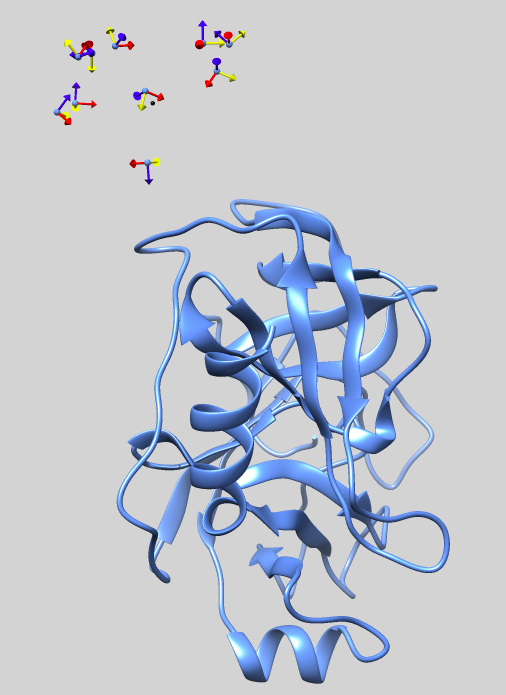

<hr>

# LightDock 2UUY example


## 1. Quick and dirty Protein-protein docking
The simplest way to perform a protein-protein docking in LightDock is to use default parameters and to only provide two [PDB](http://www.rcsb.org/pdb/static.do?p=file_formats/pdb/index.html) files for both receptor and ligand proteins.

### 1.1. Simplest example

In this basic example, we will reconstitute the PDB complex [2UUY](https://www.rcsb.org/structure/2UUY), starting from its unbound constituents.

In previous versions of LightDock, a setup step was not required. This has changed from **version 0.5.0** and now a simulation setup is required. Please, make sure that you have the Python3 version of LightDock installed <code>pip3 install lightdock</code>. Follow the next steps in order to perform your first protein-protein docking with LightDock:

#### 1.1.1. Copying data
Create a directory and copy the sample data provided:

```bash
cd ~/Desktop;
mkdir test;
cd test;
wget https://raw.githubusercontent.com/brianjimenez/lightdock/master/examples/2UUY/2UUY_rec.pdb;
wget https://raw.githubusercontent.com/brianjimenez/lightdock/master/examples/2UUY/2UUY_lig.pdb;
```

#### 1.1.2. LightDock setup
Execute <code>lightdock3_setup.py</code> script in order to prepare your LightDock simulation. If you execute <code>lightdock3_setup.py</code> without arguments a little help is displayed:

```bash
lightdock3_setup.py

usage: lightdock_setup [-h] [--seed_points STARTING_POINTS_SEED]
                       [-ft ftdock_file] [--noxt] [-anm] [--seed_anm ANM_SEED]
                       [-anm_rec ANM_REC] [-anm_lig ANM_LIG] [-rst restraints]
                       [-membrane]
                       receptor_pdb_file ligand_pdb_file swarms glowworms
lightdock_setup: error: too few arguments
```

There are **four** arguments needed (the ones not enclosed by [ ]) in order to setup a basic lightdock simulation. For more information about the setup stage, please check the [LightDock basics](https://lightdock.org/tutorials/basics#2-setup-a-simulation) 

For the sake of simplicity, we will generate **only 1 swarm** containing **10 glowworms** with the following command:

```bash
lightdock3_setup.py 2UUY_rec.pdb 2UUY_lig.pdb 1 10

[lightdock_setup] INFO: Reading structure from 2UUY_rec.pdb PDB file...
[lightdock_setup] INFO: 1628 atoms, 223 residues read.
[lightdock_setup] INFO: Reading structure from 2UUY_lig.pdb PDB file...
[lightdock_setup] INFO: 415 atoms, 55 residues read.
[lightdock_setup] INFO: Calculating reference points for receptor 2UUY_rec.pdb...
[lightdock_setup] INFO: Done.
[lightdock_setup] INFO: Calculating reference points for ligand 2UUY_lig.pdb...
[lightdock_setup] INFO: Done.
[lightdock_setup] INFO: Saving processed structure to PDB file...
[lightdock_setup] INFO: Done.
[lightdock_setup] INFO: Saving processed structure to PDB file...
[lightdock_setup] INFO: Done.
[lightdock_setup] INFO: Calculating starting positions...
[lightdock_setup] INFO: Generated 1 positions files
[lightdock_setup] INFO: Done.
[lightdock_setup] INFO: Preparing environment
[lightdock_setup] INFO: Done.
[lightdock_setup] INFO: LightDock setup OK
```

**A new file called** <code>setup.json</code> **has been generated with the simulation information**:

```bash
$ cat setup.json

{
    "anm_lig": 10,
    "anm_rec": 10,
    "anm_seed": 324324,
    "ftdock_file": null,
    "glowworms": 10,
    "ligand_pdb": "2UUY_lig.pdb",
    "membrane": false,
    "noh": false,
    "noxt": false,
    "receptor_pdb": "2UUY_rec.pdb",
    "restraints": null,
    "starting_points_seed": 324324,
    "swarms": 1,
    "use_anm": false,
    "verbose_parser": false
}

```

Besides of <code>setup.json</code>, we find that several <code>lightdock#</code> files have been generated as well as an <code>init</code> directory. This directory contains both the exact positions of the swarms (in this case a unique swarm <code>cluster_centers.pdb</code>) and the starting positions of the glowworms (in this case 10 ligand conformations <code>starting_positions_0.pdb</code>). In the latter, <code>0</code> indicates the ID of the swarm. Please refer to the following picture for a graphical description of the setup:



#### 1.1.3. LightDock run
Once the setup is successful, execute <code>lightdock3.py</code> script in order to run your first LightDock simulation. If you execute <code>lightdock3.py</code> without arguments a little help is displayed:

```bash
lightdock3.py

usage: lightdock [-h] [-f configuration_file] [-s SCORING_FUNCTION]
                 [-sg GSO_SEED] [-t TRANSLATION_STEP] [-r ROTATION_STEP] [-V]
                 [-c CORES] [--profile] [-mpi] [-ns NMODES_STEP] [-min]
                 [--listscoring]
                 setup_file steps
lightdock: error: too few arguments
```

There are **two** arguments needed (the ones not enclosed by [ ]) in order to run lightdock simulation. For more information about the simulation stage, please check the [LightDock basics](https://lightdock.org/tutorials/basics#3-run-a-simulation)

In this case, we will only perform **10 steps** of GSO optimization as:

```bash
lightdock3.py setup.json 10


@> ProDy is configured: verbosity='info'
[lightdock] INFO: simulation parameters saved to ./lightdock.info
[lightdock_setup] INFO: Reading structure from 2UUY_rec.pdb PDB file...
[lightdock_setup] INFO: 1628 atoms, 223 residues read.
[lightdock_setup] INFO: Reading structure from 2UUY_lig.pdb PDB file...
[lightdock_setup] INFO: 415 atoms, 55 residues read.
[lightdock] INFO: Loading scoring function...
[lightdock] INFO: Using DFIRE scoring function
[lightdock] INFO: Done.
[kraken] WARNING: Number of cores has not been specified or is incorrect. Using available cores.
[kraken] INFO: Kraken has 4 tentacles (cpu cores)
[kraken] INFO: Tentacle ready with 1 tasks
[kraken] INFO: Tentacle ready with 0 tasks
[kraken] INFO: Tentacle ready with 0 tasks
[kraken] INFO: Tentacle ready with 0 tasks
[kraken] INFO: 1 ships ready to be smashed
[lightdock] INFO: Monster spotted
[kraken] INFO: Release the Kraken!
[kraken] INFO: folding tentacle Tentacle-2
[0] step 1
[kraken] INFO: folding tentacle Tentacle-4
[kraken] INFO: folding tentacle Tentacle-3
[0] step 2
[0] step 3
[0] step 4
[0] step 5
[0] step 6
[0] step 7
[0] step 8
[0] step 9
[0] step 10
[kraken] INFO: folding tentacle Tentacle-1
[kraken] INFO: 1 ships destroyed
[lightdock] INFO: Finished.
```

By default, LightDock makes use of the DFIRE scoring function. For a complete list of supported socring functions, please run <code>lightdock --listscoring</code>.

There is a warning on the number of CPU cores used. By default, LightDock will look for the total number of cores. If you want to specify a different number, use the flag <code>-c NUMBER_CORES</code>. **Note that MPI is also supported using the -mpi flag**.

For each of the swarms, there is a folder called <code>swarm_X</code>. In our example, we only generated **one swarm** so there is only a folder <code>swarm_0</code>. Inside, we can find the file containing the result of the simulation <code>gso_10.out</code>. In the output files <code>gso_X.out</code>, X refers to the step number.

In this file, every line corresponds to a glowworm agent in the algorithm. The numbers enclosed by ( ), refer to the x,y,z coordinates in the translational space + the quaternion vector (q = a + 0i + 0j + 0k) in the rotational space. If ANM were enabled, this vector would expand by the number normal modes considered for receptor and ligand respectively. The coordinates are followed by the ID of the complex and the last column refers to the scoring, in this case as calculated wiht DFIRE (fastdfire).

```bash
head -2 swarm_0/gso_10.out

#Coordinates  RecID  LigID  Luciferin  Neighbor's number  Vision Range  Scoring
(31.4171143,  1.8570079, -6.3956223, -0.1058407, -0.4849369,  0.5997430, -0.6276482)    0    0  11.25395618  0 4.200   7.52800101
```

Finally, to generate the final docked PDB structures, we will use the script **lgd_generate_conformations.py**:

```bash
cd swarm_0;
lgd_generate_conformations.py ../2UUY_rec.pdb ../2UUY_lig.pdb gso_10.out 10

@> ProDy is configured: verbosity='info'
[generate_conformations] INFO: Reading ../lightdock_2UUY_rec.pdb receptor PDB file...
[generate_conformations] INFO: 1628 atoms, 223 residues read.
[generate_conformations] INFO: Reading ../lightdock_2UUY_lig.pdb ligand PDB file...
[generate_conformations] INFO: 415 atoms, 55 residues read.
[generate_conformations] INFO: Read 10 coordinate lines
[generate_conformations] INFO: Generated 10 conformations
```

Inside the <code>swarm_0</code> folder 10 new PDB structures corresponding to the 10 glowworm agents used in the example have been generated.

For a more complete description of the algorithm as well as different tutorials, please refer to [LightDock](https://lightdock.org/), or check the following references:

LightDock protocol and the updates to make use of residue restraints have been published in [Oxford Bioinformatics](https://academic.oup.com/bioinformatics) journal. Please cite these references if you use LightDock in your research:

**LightDock: a new multi-scale approach to protein–protein docking**<br>
[Brian Jiménez-García](http://bjimenezgarcia.com), Jorge Roel-Touris, Miguel Romero-Durana, Miquel Vidal, Daniel Jiménez-González and Juan Fernández-Recio<br>
*Bioinformatics*, Volume 34, Issue 1, 1 January 2018, Pages 49–55, [https://doi.org/10.1093/bioinformatics/btx555](https://doi.org/10.1093/bioinformatics/btx555)

 **LightDock goes information-driven**<br>
 Jorge Roel-Touris, Alexandre M.J.J. Bonvin and [Brian Jiménez-García](http://bjimenezgarcia.com)<br>
 *Bioinformatics*, btz642; doi: [https://doi.org/10.1093/bioinformatics/btz642](https://doi.org/10.1093/bioinformatics/btz642)
